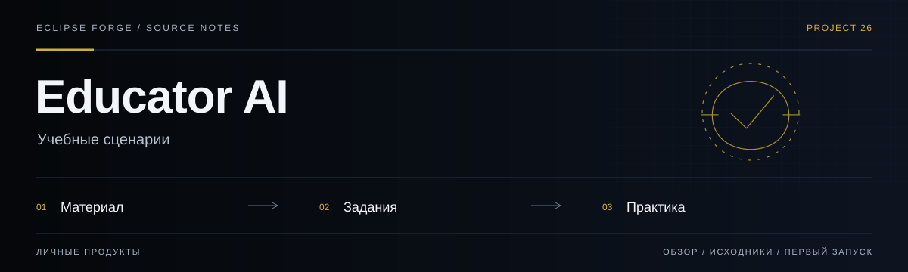
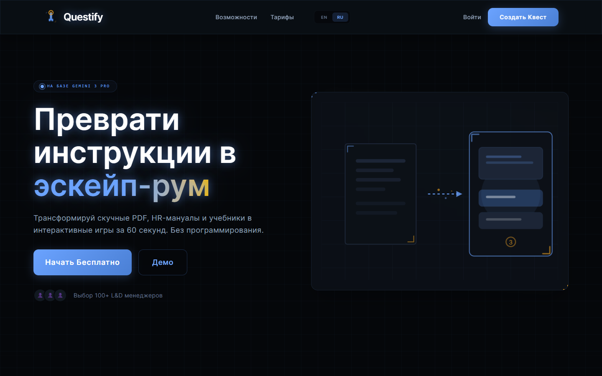
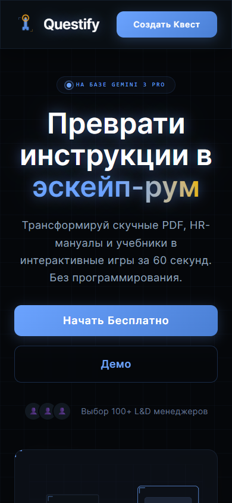

# Educator AI



**Учебные сценарии.** Преобразование учебного материала в интерактивные задания, квесты и структурированные учебные сценарии.

<!-- repository-guide:start -->
[Интерфейс](#readme-interface) · [Первый запуск](#readme-start) · [Что внутри](#readme-map) · [Путеводитель](docs/repository-guide.md#start) · [Карта кода](docs/repository-guide.md#map) · [Проверки](docs/repository-guide.md#checks) · [Границы и права](docs/repository-guide.md#boundaries)

<a id="readme-interface"></a>

## Интерфейс



**Главная Questify: вход в создание учебного квеста и демонстрационный сценарий.**

Локальный снимок от 8 сентября 2026: отдельный профиль браузера, без внешних API и пользовательских секретов. Это вид интерфейса, не подтверждение production-функций.

<details>
<summary><strong>Мобильный экран · 390 px</strong></summary>



</details>

[Открыть в полном размере](docs/assets/ui/overview.png) · [Данные снимка](docs/assets/ui/capture.json)

<a id="readme-map"></a>

## Проект за минуту

- **[Квизы](<components/QuizPlayer.tsx>)** — Интерактивное прохождение учебных вопросов.
- **[Квесты](<components/EscapeRoomPlayer.tsx>)** — Игровая подача учебного материала.
- **[Учебные треки](<shared/lib/learning>)** — Структурированные сценарии обучения и проверки.

<a id="readme-start"></a>

## Начать локально

**Среда:** Node.js и npm. **Источник:** [package.json](<package.json>).

Из корня клонированного репозитория:

```bash
npm ci
npm run dev
```

Интерфейс и внешние AI-вызовы — разные этапы. До подключения провайдера проверьте настройки, стоимость и обработку ключей; значения секретов в README не размещаются.

<details>
<summary><strong>Перед первым запуском и изменением кода</strong></summary>

- Команды сверены с исходниками 8 сентября 2026. Это инструкция, а не отметка об успешном запуске или текущем production.
- Установка зависимостей может обращаться в registry и выполнять lifecycle scripts. Используйте отдельную рабочую среду и демонстрационные данные.
- Педагог проверяет содержание и ответы. Загруженные документы и данные учащихся не должны попадать в публичные примеры.
- [ROADMAP.md](<ROADMAP.md>)

</details>
<!-- repository-guide:end -->

## About

**Questify** -- AI-платформа для геймификации обучения. Загрузите любой учебный текст, и Gemini AI мгновенно превратит его в интерактивный квиз или escape room с сюжетом, персонажами и головоломками.

Проект задуман как инструмент для корпоративного обучения (L&D) и edtech: сокращает создание курса с недель до минуты.

---

## Features

| Фича | Описание |
| :--- | :--- |
| **Quiz Mode** | AI генерирует вопросы на понимание с мгновенной обратной связью |
| **Escape Room Mode** | Нелинейные текстовые квесты с инвентарём и ветвлением сюжета |
| **PDF Upload** | Загрузка учебных материалов напрямую |
| **EN/RU Localization** | Полная поддержка английского и русского языков |
| **Dark UI** | Премиальный интерфейс с glassmorphism и анимациями |
| **GitHub Onboarding** | Интерактивная практика GitHub Flow без установки и API-ключа: repository → branch → commit → pull request → merge. Прогресс сохраняется локально в браузере |
| **Deck → урок** | Импорт утверждённого deck.job.v1 из Eclipse AI Hub: строгая локальная проверка, preview слайдов и notes, повторный teacher approval и экспорт плана урока в Markdown |

---

## Product radar

Источник: [Eclipse Library · July 2026 project integration](https://library.eclipse-forge.ru/#guide/july-2026-project-integration).

| Reference | Как использовать |
|-----------|------------------|
| **Large Language Model Course** | База для трека "LLM Engineer": fundamentals, embeddings, fine-tuning, quantization, evals, deployment и упаковка AI-сервисов |
| **Language Model Builder** | Reference для будущего provider-neutral трека tokenizer → pretraining → SFT → preference optimization. Закрытое macOS-приложение не копировать и не встраивать; собственный урок строить на публичном dataset с понятной лицензией |
| **production-agentic-rag-course** | Практический трек “Research Agent”: arXiv/PDF → RAG → cited answer → Telegram bot / web workflow |
| **ShipThatCode** | Reference для курсов “собери систему”: Redis, Git, БД, game engine как практические квесты вместо сухой теории |
| **Voicetypr / Sokuji** | Лекции и созвоны → transcript → summary → quiz/escape room. Live translation — только с явным consent |
| **Claude Science beta** | Reference для проверяемых исследовательских проектов: источник → анализ → график → отчёт → ревью цитат/расчётов |
| **PPT Master** | MIT reference для renderer: собственный DeckJob import уже работает; editable PPTX остаётся отдельным этапом и не заявлен как готовый |

Потенциальная фича: генератор учебного пути из LLM Course → модули → квизы → escape-room задания → итоговый проект.
Вторая линия: исследовательский курс → reproducible notebook/report → editable presentation.

---

## Tech Stack

- **Core:** React 19, TypeScript 5.8
- **Build:** Vite 6
- **AI:** Google Gemini AI (`@google/genai`)
- **Animation:** Framer Motion
- **Styling:** Tailwind CSS (custom Quest palette)

---

## Project Structure

```
.
├── App.tsx                    # Главный компонент приложения
├── index.tsx                  # Entry point
├── types.ts                   # Re-export типов
├── components/                # UI компоненты (Button, QuizPlayer, EscapeRoomPlayer)
├── services/                  # Legacy сервисы (перенесены в shared/)
├── shared/
│   ├── lib/
│   │   ├── ai/               # Gemini AI клиент и промпты
│   │   └── game/             # Типы, движок игры, компоненты
│   └── ui/                   # Переиспользуемые UI-компоненты (Button, Branding)
└── widgets/
    ├── GamePlayer/            # Виджет игрового процесса
    └── Landing/               # Лендинг-страница
```

---

## Quick Start

### Prerequisites

- Node.js 18+
- Google Gemini API Key ([получить здесь](https://aistudio.google.com/))

### Installation

```bash
git clone https://github.com/PavelHopson/Educator-AI.git
cd Educator-AI
npm install
```

### Configuration

Скопируйте `.env.example` и укажите свой API-ключ:

```bash
cp .env.example .env
```

```env
GEMINI_API_KEY=your_api_key_here
```

### Run

```bash
npm run dev
```

---

## License

[MIT](LICENSE) &copy; 2025 PavelHopson

## AI for App Building learning track

The Course screen includes a three-stage, roughly two-hour path inspired by the official
Google AI for App Building course: understand AI limits, write a testable brief, then build
and QA a small prototype. The implementation is original and does not copy Coursera lessons.

Progress is versioned and stored only in localStorage. The track never asks for an API key,
private repository, or customer data. It explicitly treats AI Studio output as a prototype
until review, tests, mobile/accessibility checks, and a security pass are complete.